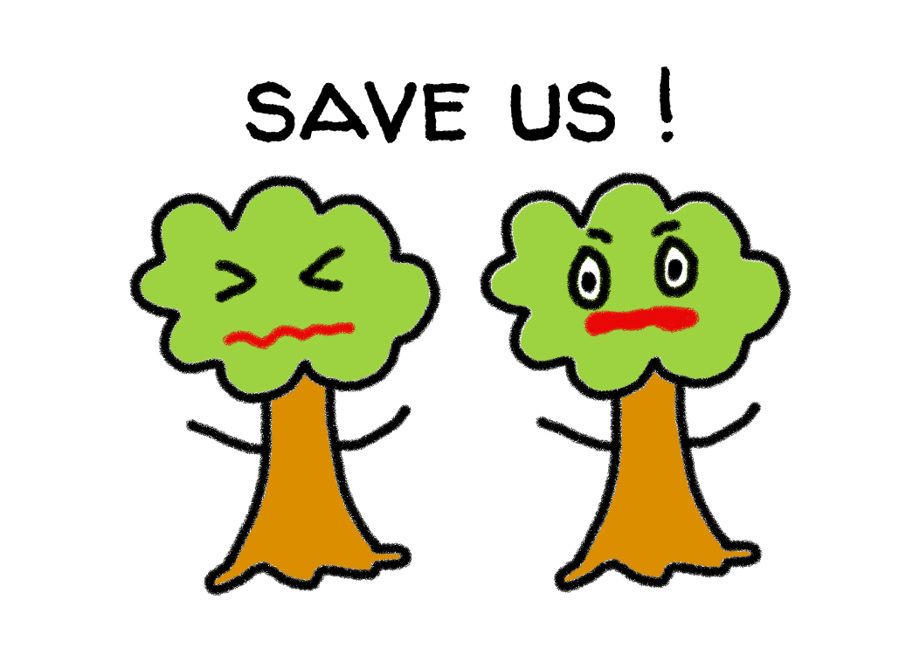
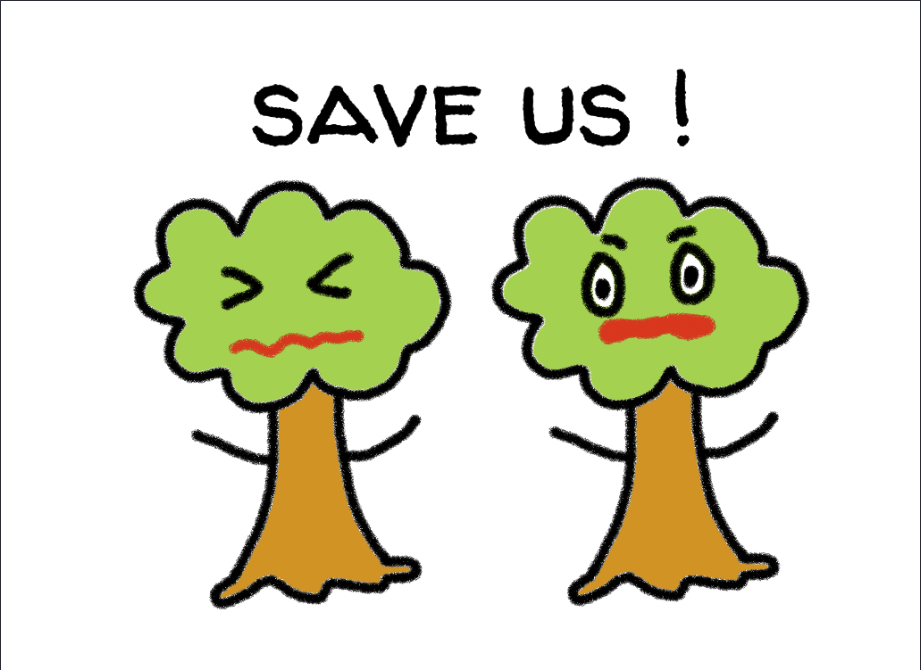

<!-- # Leaphlet -->
<!--  -->
<div align="center"></div>
<h1 align="center">Leaphlet - Save trees! Go Paperless.</h1>

This repository contains our team's submission to [Solution Challenge 2024](https://developers.google.com/community/gdsc-solution-challenge?hl=en). The challenge aims to solve for one or more of the United Nations' 17 SDGs using Google technology.

<!-- ## Table of Contents -->

<details open>
<summary><h2 style="display:inline">Table of Contents</h2></summary>
<br/>

- [What is Leaphlet?](#what-is-leaphlet)
- [Setup](#setup)
- [License](#license)
- [The Leaphlet Team](#the-leaphlet-team)
</details>

---
<a name="what-is-leaphlet"></a>

## 🧐 What is Leaphlet?
### Description
Our project, Leaphlet, is a digital brochure app created as an attempt to reduce paper waste at events, exhibitions and symposiums. The exhibitor's version allows exhibitors of an event to upload their company profile and leaflet to the app, and others invited to the event can view and save leaflets from different booths and companies through the visitor version. 
### Our Goals for Solution Challenge
The United Nations’ [Sustainable Development goals](https://sdgs.un.org/goals) we were aiming to solve was #12 Responsible Consumption and Production, #13 Climate Action, and #15 Life on Land. Through our app, we aim to reduce paper waste and prevent deforestation. 
### Main Features
- Visitor:
    - view / star / download pamphlets registered in events
- Exhibitor:
    - upload pamphlets to events
- Organizer: 
    - create events
    - send inquiries

---
<a name="setup"></a>

## 🛠️ Setup
You can either download the [apk](https://github.com/minsuk00/Leaphlet/releases) directly or run the application locally.
Use [41G8M37] as a sample event code.
### Built with
- Frontend: Flutter (Android)
- Backend: Firebase (FlutterFire)
### How to run locally:
1. Download and [install flutter](https://docs.flutter.dev/get-started/install)
1. Clone the project to local machine
    ```
    git clone https://github.com/minsuk00/Leaphlet.git
    cd Leaphlet
    ```
1. Install required packages
    ```
    dart pub get
    ```
1. Connect your android device
1. Run the application:
    ```
    flutter run
    ```
    (warning: Google log-in functionality requires pre-configuration of Firebase. Disable *showGuestRestrictionDialog()* method in *lib/pages/start.dart* as a bypass)
---
<a name="license"></a>

## 🛡️ License
This project is licensed under the MIT License :)

<a name="the-leaphlet-team"></a>

## 😀 The Leaphlet Team
Leaphlet was created by Ryudai, Sara, Hosu, and Minsuk